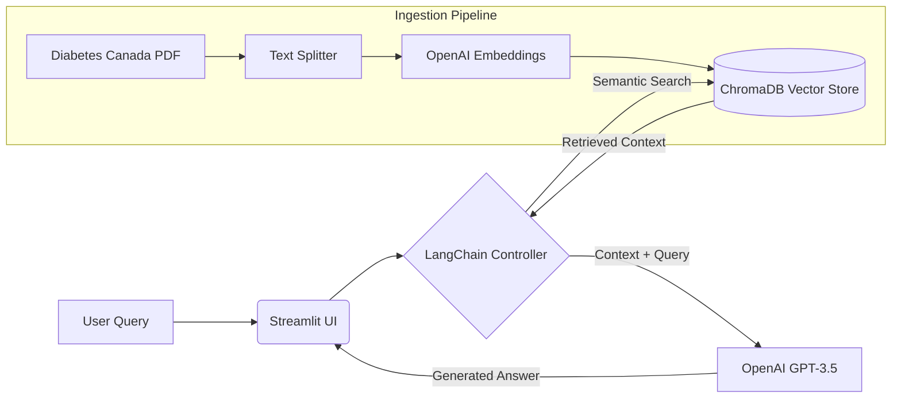

# 🏥 Medi-Insight: Clinical Guideline AI Assistant


> **Live Demo:** [Click here to try Medi-Insight](https://diabetesrobot.azurewebsites.net/)

## 📖 Overview

**Medi-Insight** is an end-to-end **Retrieval-Augmented Generation (RAG)** application designed to assist healthcare professionals in navigating complex clinical protocols.

Unlike generic chatbots, Medi-Insight is grounded in the **Diabetes Canada Clinical Practice Guidelines (2018-2024 Updates)**. It ingests unstructured medical PDFs, creates semantic vector embeddings, and delivers evidence-based answers with high accuracy, reducing information retrieval time by up to **90%**.

## 🏗️ System Architecture

This project follows a modern MLOps workflow, containerized with Docker and deployed on Microsoft Azure Web Apps.



## ✨ Key Features

* **🇨🇦 Localized Knowledge Base:** Specifically trained on *Diabetes Canada Clinical Practice Guidelines*, ensuring relevance for the Canadian healthcare context.
* **🔍 Context-Aware Retrieval:** Uses **ChromaDB** for vector search to find the exact pages relevant to the user's query.
* **🧠 LLM Integration:** Leverages **OpenAI GPT-3.5-turbo** via **LangChain** to synthesize clinical answers from retrieved context.
* **🐳 Dockerized:** Fully containerized application ensuring consistent performance across development and production environments.
* **☁️ Cloud Native:** Deployed on **Azure Web App for Containers**, demonstrating scalable cloud architecture skills.

## 🛠️ Tech Stack

* **LLM Orchestration:** LangChain
* **Frontend:** Streamlit
* **Vector Database:** ChromaDB
* **Embeddings & Model:** OpenAI API (text-embedding-3, gpt-3.5-turbo)
* **Containerization:** Docker
* **Cloud Platform:** Microsoft Azure (Web App)
* **Language:** Python 3.9

## 🚀 How to Run Locally

1. **Clone the repository**

    ```bash
    git clone [https://github.com/YourUsername/medi-insight.git](https://github.com/YourUsername/medi-insight.git)
    cd medi-insight
    ```

2. **Set up Environment Variables**
    Create a `.env` file in the root directory:

    ```env
    OPENAI_API_KEY=your_sk_key_here
    ```

3. **Run with Docker (Recommended)**

    ```bash
    docker build -t medi-insight .
    docker run -p 8501:8501 medi-insight
    ```

    Access the app at `http://localhost:8501`

4. **Run Manually**

    ```bash
    pip install -r requirements.txt
    streamlit run app.py
    ```

## 📄 License

This project is open-source and available under the [MIT License](LICENSE).

---
*Created by Eldon Wen - Analytics Engineer & AI Enthusiast based in Toronto.*
